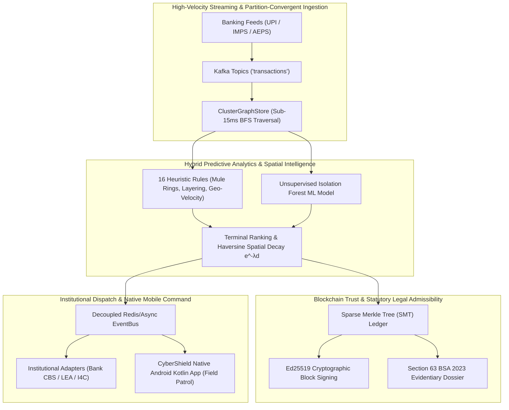

# CyberShield: Predictive Analytics Framework for Cybercrime Interception & Cash-Out Forecasting
### National Defense Infrastructure for Financial Cyber Fraud Mitigation
**Problem Statement ID:** 26184 | **Ministry of Home Affairs (MHA)** • **Indian Cyber Crime Coordination Centre (I4C), CIS Division**  
**Theme:** Blockchain & Cybersecurity | **Category:** Software

[](https://www.python.org/)
[-green.svg)](https://developer.android.com/)
[](https://kotlinlang.org/)
[](https://www.mha.gov.in/)
[](https://en.wikipedia.org/wiki/Merkle_tree)
[](https://github.com/harshada2576/SIH2026)
[-emerald.svg)](tests/)

---

## 🌐 Quick Access & Live Deployments

* **Official Interactive Portal:** [https://harshada2576.github.io/SIH2026/](https://harshada2576.github.io/SIH2026/)
* **Official Signed Release APK (v1.0.0):** [Download CyberShield-v1.0.0-release.apk](https://github.com/harshada2576/SIH2026/releases/download/v0.0.1/CyberShield-v1.0.0-release.apk)
* **Live Cloud Core API:** [https://sih-render.seucra.tech/](https://sih-render.seucra.tech/) (Fallback: [https://cybershield-backend-g8fl.onrender.com/](https://cybershield-backend-g8fl.onrender.com/))
* **Evidentiary Dossier Spec:** [`docs/SIH_MASTER_PITCH_AND_WINNING_DOSSIER.md`](docs/SIH_MASTER_PITCH_AND_WINNING_DOSSIER.md)

---

## 1. Executive Summary & National Purpose

India's National Cybercrime Reporting Portal (NCRP) and the Citizen Financial Cyber Fraud Reporting and Management System (CFCFRMS / Helpline 1930) receive over **8,000+ complaints daily**. Despite rapid advances in digital payments via UPI, IMPS, and AEPS, financial recovery rates for cybercrime victims remain under **5%**.

### The Fundamental Flaw of Reactive Defense:
1. **The Time Lag:** Victims typically discover and report fraud 2 to 24 hours after an unauthorized debit.
2. **Rapid Multi-Hop Layering:** Organized syndicates systematically route stolen funds through 3 to 6 intermediate mule accounts within minutes.
3. **Irreversible Physical Cash-Out:** Funds are promptly withdrawn as physical currency at Bank ATMs, AEPS Micro-ATMs, or POS agents. Once cash leaves the terminal, digital traceability ends.

```
[ Traditional Reactive Workflow ]
Victim Debited ➔ (2-24 hrs delay) ➔ 1930 Complaint ➔ Bank Lien Processed ➔ ❌ Funds Already Withdrawn as Cash (Recovery < 5%)

[ CyberShield Proactive Interception ]
Live Stream Hop Analysis ➔ Real-Time ML Anomaly & Heuristic Scoring ➔ 🎯 15-30 Min Advance ATM/AEPS Hotspot Forecast
  ├─ 🏦 Bank Track: Automated Differential Hold (Restricts suspicious delta, preserves legitimate citizen balance)
  └─ 🚓 Police Track: Priority Dispatch to Nearest Field Patrol with GPS Navigation, Suspect Hints & Time Window
```

**CyberShield transforms national cyber defense from post-incident complaint logging to pre-egress real-time spatial interception.**

---

## 2. Core Architectural Pillars



### Pillar 1: High-Velocity Streaming & Graph Traversal (`pipeline/`)
* **Partition Convergence:** Solves the Kafka multi-hop partition fragmentation paradox (e.g. Hop 1 on Partition 1, Hop 2 on Partition 2) using thread-safe atomic batch synchronization in `ClusterGraphStore`.
* **Sub-15ms Ingestion:** Optimized adjacency lists trace deep layering chains and detect structured smurfing subgraphs in sub-millisecond BFS cycles.

### Pillar 2: Hybrid Predictive Analytics & Terminal Ranking (`detection/`)
* **16 Explainable Rule Archetypes:** Fan-in/out, rapid forwarding (<3 min hops), shared KYC identity rings, shared device fingerprints, dormant account reactivation, and geo-velocity "impossible travel" (e.g., account debited in Mumbai and withdrawn in Hyderabad 20 minutes later).
* **Unsupervised Anomaly Model:** Isolation Forest detecting multivariate turnover anomalies and diurnal temporal deviations.
* **Spatial Probability & Time-to-Cashout Decay Equation:**
  $$S(T_i, A) = w_1 \cdot \text{Affinity}(A, T_i) + w_2 \cdot e^{-\lambda \cdot d(L_A, T_i)} + w_3 \cdot \text{Density}(T_i) + w_4 \cdot \text{TierWeight}$$
  Forecasts physical ATM or AEPS kiosk candidates with confidence scores and 15–45 min arrival windows.

### Pillar 3: Pre-Complaint Differential Hold Protocol (`api/`)
* **Zero Citizen Distress:** Traditional bank freezes lock the entire account, leaving innocent victims unable to buy food or pay rent.
* **Differential Delta Freeze:** Restricts strictly the suspicious incoming funds delta (e.g. ₹50,000) while leaving pre-existing legitimate customer balances (e.g. ₹20,000) completely untouched and spendable.

### Pillar 4: Section 63 BSA 2023 Evidentiary Dossier (`export/`)
* **Statutory Compliance:** Built specifically to satisfy Section 63 of India's **Bharatiya Sakshya Adhiniyam, 2023 (BSA)** (replacing Section 65B of the Indian Evidence Act).
* **Court Admissibility:** Automatically exports digitally signed electronic evidence certificates containing canonical SHA-256 digests, chronological hop leg hashes, and cryptographic proof paths for trial courts.

### Pillar 5: Sparse Merkle Tree (SMT) Immutability (`audit/`)
* **Tamper-Evident Ledger:** Every transaction, risk evaluation, and officer intervention is committed to an append-only Sparse Merkle Tree signed with **Ed25519 keypairs**.
* **$O(\log N)$ Sibling Inclusion Proofs:** Verifiable in $< 2\text{ ms}$ without exposing sensitive customer banking records in court.

### Pillar 6: Native Android Mobile Command Center (`CyberShield/`)
* **Architecture:** 100% Native Kotlin & Jetpack Compose (Zero web wrappers, sub-60fps hardware-accelerated GIS).
* **Operational Capabilities:** Live GIS radar map, visual multi-hop fund graph, dual-persona switching (Police Investigator vs Bank Officer), and multi-cloud fail-safe routing.

---

## 3. Real-World Multi-Year Dataset Benchmark

To prove production readiness beyond toy academic prototypes, CyberShield includes an enterprise-scale synthetic simulation engine:

| Metric / Dimension | Production Scale | Description |
|---|---|---|
| **Total Transactions** | **10,053,923** (> 1 Crore) | Validated, chronological balance-replayed transaction ledger |
| **Monitored Accounts** | **500,000** | Structured across veteran (>1000d), established, and fresh mule tiers |
| **Physical Terminals** | **50,000+** | Bank ATMs, AEPS Micro-ATMs, and POS kiosks across 20+ Indian hubs |
| **Historical Horizon** | **2024 – 2026** (1,003 Days) | Multi-year timeline capturing macro UPI growth (1.55×), salary cycles (1st–5th), and festive peaks |
| **Fraud Campaigns** | **14,400 campaigns** | Injected across all 16 distinct fraud archetypes with ground-truth labels |
| **Verification** | **0 Missing Records** | Verified via `verify.py` with zero integrity violations |

---

## 4. Institutional Integration Architecture

CyberShield provides production-ready adapters (`pipeline/integration_adapters.py`) matching national financial and law enforcement interfaces:

```text
 ┌────────────────┐         ┌────────────────────────────────┐         ┌────────────────┐
 │    Bank CBS    │ <====== │       CyberShield API          │ ======> │  State Police  │
 │  (Core Banking │         │   (Pre-Egress Interception)    │         │  Control Room  │
 │  REST/ISO8583) │         └────────────────────────────────┘         │  (112 / PCR)   │
 └────────────────┘                         ║                          └────────────────┘
                                            ▼
                                ┌───────────────────────┐
                                │     I4C National      │
                                │   CFCFRMS / 1930 Hub  │
                                └───────────────────────┘
```

* **Bank Core Banking Adapter (`POST /api/v1/bank/hold`):** Places differential provisional holds and releases verified legitimate funds.
* **Law Enforcement Adapter (`POST /api/v1/lea/alert`):** Transmits emergency patrol intercept packets containing target ATM coordinates, turn-by-turn routing, suspect KYC/device hints, and predicted arrival window.
* **I4C National Hub Adapter (`POST /api/v1/i4c/sync`):** Synchronizes inter-state mule intelligence and updates national blacklists across jurisdictions.

---

## 5. Repository Structure

```text
SIH2026/
├── CyberShield/                   # Native Android Kotlin App (Jetpack Compose)
│   ├── app/src/main/java/         # Application source (Radar, Investigation, Net)
│   └── cybershield-release.jks    # Official I4C release signing keystore
├── api/                           # FastAPI REST & WebSocket Live Server
│   ├── server.py                  # Core backend with root health check & cloud detection
│   ├── engine.py                  # In-memory case orchestration & heatmap generator
│   ├── pubsub.py                  # Multi-worker Redis/Async EventBus
│   ├── validation_routes.py       # Benchmark validation endpoints
│   └── integration_routes.py      # Institutional adapter contracts (Bank/LEA/I4C)
├── audit/                         # Blockchain-Lite & Cryptographic Trust
│   ├── merkle_ledger.py           # Sparse Merkle Tree (SMT) with Ed25519 signing
│   └── tamper_demo.py             # Live disk-tampering detection demo
├── detection/                     # Detection & Geospatial Ranking Engine
│   ├── scorer.py                  # Hybrid scoring engine (16 rules + Isolation Forest)
│   ├── terminal_ranking.py        # Spatial proximity, TDI density, & corridor prediction
│   └── rules/                     # 16 modular explainable heuristic rule implementations
├── export/                        # Statutory Legal Evidence System
│   └── evidentiary_dossier.py     # Section 63 BSA 2023 court-admissible certificate generator
├── pipeline/                      # High-Throughput Stream Processing
│   ├── cluster_graph.py           # Partition-convergent Kafka graph store
│   ├── validation_engine.py       # Multi-seed prediction benchmark runner
│   └── integration_adapters.py    # Simulated institutional Bank/LEA/I4C adapters
├── data-generator/                # Enterprise 1 Crore+ Multi-Year Dataset Engine
├── docs/                          # Master Documentation & Defense Guides
│   ├── SIH_MASTER_PITCH_AND_WINNING_DOSSIER.md
│   ├── VALIDATION_PROTOCOL.md
│   └── VALIDATION_AND_INTEGRATION.md
├── public/                        # Static landing page for GitHub Pages
│   └── index.html                 # Tactical command room theme with live API tester
├── release_apk/                   # Signed release binaries (v1.0.0, 53 MB)
└── tests/                         # Complete automated test suite (176 tests passing)
```

---

## 6. Getting Started & Local Execution

### Prerequisites
* Python 3.10+ (tested through Python 3.14)
* Android SDK 34 (for Android app builds)
* Java 17 (for Gradle and keytool)

### Step 1: Install Dependencies
```bash
python3 -m venv .venv
source .venv/bin/activate
pip install -r requirements.txt
```

### Step 2: Run Automated Test Suite
```bash
# Run all 176 automated unit, security, Merkle, and integration tests
pytest tests/ -v
```

### Step 3: Launch Live Services
```bash
# Start Mock Bank (8001), Mock NCRP (8002), and CyberShield API (5003)
python scripts/run_hackathon.py
```

### Step 4: Run Live Interactive Demonstrations
```bash
# 1. Cryptographic Tamper Defense & O(log N) SMT Proof Demo
python -m audit.tamper_demo

# 2. End-to-End Investigation & Section 63 BSA Certificate Export
python scripts/verify_e2e_flow.py

# 3. Multi-Mule Ring & Geo-Velocity Impossible Travel Demo
python scripts/demo_phase2.py
```

### Step 5: Install Mobile Command App on Android
Download `release_apk/CyberShield-v1.0.0-release.apk` (or install via ADB):
```bash
adb install release_apk/CyberShield-v1.0.0-release.apk
```
*The app automatically searches for `https://sih.seucra.tech` (local tunnel) $\rightarrow$ `https://sih-render.seucra.tech` (cloud fallback) $\rightarrow$ local Wi-Fi UDP discovery.*

---

## 7. Statutory & Legal Standards Compliance

* **Bharatiya Sakshya Adhiniyam, 2023 (BSA):** Full compliance with **Section 63** regarding the admissibility of electronic records, hash digest preservation, and certificate of origin.
* **Reserve Bank of India (RBI) Circular DBR.No.Leg.BC.78/09.07.005/2017-18:** Zero liability protection for citizens reporting within 3 days; supported via differential provisional holds.
* **Information Technology Act, 2000 (Section 43A, 66C, 66D):** Electronic trail preservation for identity theft and impersonation cheating.

## 8. Engineering Team & Core Contributors

| Contributor | Focus Area & Engineering Role |
| :--- | :--- |
| **[@seucra](https://github.com/seucra)** | **Systems Architecture & Security Lead** — Merkle Audit Ledger, Multi-Cloud Ingestion, Cryptographic Chain of Custody & BSA Dossiers |
| **[@harshada2576](https://github.com/harshada2576)** | **Project Lead & Full-Stack Orchestration** — Heuristic Rule Scorer, Anomaly Detection Pipeline & Engine Coordination |
| **[@The-CoDexR3kt](https://github.com/The-CoDexR3kt)** | **Institutional Integration & Validation** — Institutional Adapters (Bank CBS / LEA / I4C), Pre-Registered Validation Engine & Contract Tests |
| **[@NikamShreya696](https://github.com/NikamShreya696)** | **Data Architecture & Simulation** — 1 Crore+ Multi-Year Synthetic Simulation Engine, Diurnal Curves & Kafka Producer |
| **[@abaanmhaisker](https://github.com/abaanmhaisker)** | **Mobile Frontend & UX Lead** — CyberShield Native Android Jetpack Compose App, MapLibre GIS Radar & Investigation Canvas |
| **Dakshata Mhatre** | **Evidence Verification & Threat Modeling** — Evidentiary Dossier Validation, Fraud Scenario Testing & Quality Assurance |

---

## 9. License

Licensed under the **Apache License, Version 2.0**. See the [LICENSE](LICENSE) file for complete terms and patent grant provisions. Developed for national cybersecurity enhancement and public interest under the **Ministry of Home Affairs (I4C)** framework.

