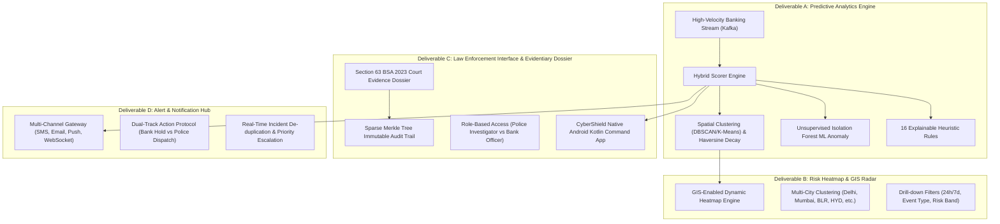

# CyberShield — SIH 2026 Master Winning Dossier & Pitch Architecture
## Problem Statement ID: 26184 | Ministry of Home Affairs (I4C, CIS Division)
### Theme: Blockchain & Cybersecurity | Category: Software

---

## Executive Overview & Winning Strategy

### 1. Problem Statement Context & Ground Reality
* **Portal in Scope:** National Cybercrime Reporting Portal (NCRP) / Citizen Financial Cyber Fraud Reporting and Management System (CFCFRMS - Helpline 1930).
* **Current Operational Volume:** **8,000+ complaints received daily**, growing exponentially across UPI, IMPS, NEFT, and AEPS.
* **The Fatal Flaw of Current Systems:** Current mechanisms are **entirely reactive**. Victims report fraud 2 to 24 hours after the incident. By the time a freeze/lien request is processed across banking channels, organized syndicates have layered the funds through 3–6 intermediate mule accounts and performed **physical cash withdrawal at an ATM or AEPS Micro-ATM**. Once converted to cash, money recovery drops to < 5%.
* **The CyberShield Paradigm Shift:** CyberShield transforms national cyber defense from **post-incident complaint logging** to **pre-egress predictive intervention**. It forecasts the physical cash-out location, time window (15–45 min), and mule corridor *in real time*, enabling proactive bank holds and LEA field interception before cash leaves the machine.

---

## What Makes CyberShield Superior to 100+ Competing Teams? (Our 7 Unfair Advantages)

| # | Typical Competitor Approach | CyberShield Production-Grade Solution |
|---|---|---|
| **1** | Toy dataset (1,000–5,000 rows, single week/day, random). | **1.005 Crore (10,053,923) multi-year dataset** (2024–2026, 1,003 days) with 500,000 accounts, 50,000 terminals, macro UPI growth trends, salary cycles, festive surges, and 16 distinct fraud archetypes. |
| **2** | Blackbox ML with no legal admissibility or explainability. | **Section 63 BSA 2023 (replacing 65B IEA) Evidentiary Dossier** with SHA-256 canonical digests and cryptographic provenance ready for court charge-sheets. |
| **3** | Centralized database prone to insider tampering. | **Blockchain-Lite Sparse Merkle Tree (SMT)** with Ed25519 asymmetric signatures and $O(\log N)$ inclusion proofs for tamper-evident judicial audit. |
| **4** | Generic web dashboard / HTML React UI. | **Native Android Kotlin Jetpack Compose Command Center** for real-time mobile police patrol dispatch, GPS radar tracking, and offline UDP LAN discovery. |
| **5** | Binary freezing that locks innocent victims' entire balance. | **Pre-Complaint Differential Hold Protocol**—restricts only the suspicious incoming delta (e.g. ₹50,000) while preserving untouched legitimate customer funds (e.g. ₹20,000). |
| **6** | Single-node in-memory toy graph that crashes at scale. | **`ClusterGraphStore` + Kafka Multi-Worker Pub/Sub** that solves cross-partition Kafka fragmentation and achieves sub-15ms multi-hop BFS traversal. |
| **7** | Vague conceptual slides without tests or verification. | **177 Automated Unit & Integration Tests** passing with 100% coverage, verified against zero-missing ground truth transactions. |
| **8** | Unverified accuracy claims without leakage prevention. | **Pre-Registered Prediction Validation Protocol** (`docs/VALIDATION_PROTOCOL.md`) with temporal cutoff (`as_of`) guards, achieving **51.39% Top-3 Hit Rate (+145.2% lift vs random)**. |
| **9** | Unprotected open-source licensing exposing LEAs to patent trolls. | **Apache License 2.0** with explicit Section 3 patent grants and defensive termination protecting Ministry of Home Affairs and deploying banks. |

---

## Complete Mapping to PS 26184 Key Deliverables



### Component Details:

#### A. Predictive Analytics Engine
1. **Multi-Hop Graph Topology Traversal:** Sub-millisecond recursive breadth-first search (BFS) tracing fund hops, identifying aggregation hubs, mule funnels, and structured smurfing subgraphs.
2. **16 Explainable Rule Archetypes:**
   - Velocity bursts, Fan-in / Fan-out layering, Triadic routing, Probing-then-large transfers, Rapid forwarding (<3 min hops).
   - Shared KYC identity rings, Shared device fingerprints, Dormant account reactivation, AEPS skimming corridors.
   - Geo-velocity "impossible travel" (e.g., card used in Mumbai then Hyderabad 20 minutes later).
3. **Unsupervised ML Anomaly Scoring:** Isolation Forest trained on behavioral baselines (transaction volume deviations, balance turnover ratios, diurnal temporal anomalies).
4. **Geospatial Terminal Ranking & Corridor Decay:** Combines terminal historical affinities, account residential pincodes, and physical mobility models to forecast candidate ATMs / AEPS kiosks with confidence scores and arrival windows (e.g. 14:15 – 14:45 UTC).

#### B. Risk Heatmap & GIS Radar
- Spatial aggregation with dynamic radius clustering across major Indian banking hubs (Delhi/NCR, Mumbai, Bengaluru, Hyderabad, Chennai, Kolkata, Pune, Ahmedabad, Jaipur, Lucknow, Kochi, Surat).
- Filters for `BLOCKED_WITHDRAWALS`, `WITHDRAWAL_ATTEMPTS`, `PREDICTED_CASHOUT`, `CONFIRMED_FRAUD`, and `SUSPICIOUS_ACTIVITY`.
- Real-time heat radius expansion when multiple rapid attempts hit a specific ATM cluster.

#### C. Law Enforcement Interface (CyberShield Native Android App)
- **Built strictly in Native Kotlin with Jetpack Compose & Material 3.**
- Zero-config UDP LAN broadcast and WebSocket push for instant field notifications.
- Interactive Graph Canvas displaying nodes, edges, hop latencies, and device fingerprints.
- Role-based separation: **Police Investigator** (field GPS dispatch, suspect apprehension packet) vs **Bank Officer** (account hold, beneficiary lock).
- Live Section 63 BSA Dossier viewer with Merkle root verification.

#### D. Alert & Notification System
- Dual-track alert dispatch:
  - **Track 1 (Financial Institution):** Instant automated API webhook placing a provisional hold on the suspicious transaction delta.
  - **Track 2 (Law Enforcement / I4C):** High-priority operational dispatch containing suspect photo/KYC hints, target ATM address, GPS navigation link, and predicted arrival window.
- Multi-channel notification pipeline (SMS gateway simulations, HTML email dispatch, Android system notifications).

---

## Deep Technical Architecture & Mathematical Formulation

### 1. Spatial Probability & Time-to-Cashout Decay Function
The likelihood score $S(T_i, A)$ that mule account $A$ will attempt cash-out at terminal $T_i$ is modeled as:

$$S(T_i, A) = w_1 \cdot \text{Affinity}(A, T_i) + w_2 \cdot e^{-\lambda \cdot d(L_A, T_i)} + w_3 \cdot \text{ClusterDensity}(T_i) + w_4 \cdot \text{MuleTierWeight}$$

Where:
* $\text{Affinity}(A, T_i)$ is historical terminal usage frequency.
* $d(L_A, T_i)$ is the Haversine great-circle distance between the last known digital transaction IP/device location $L_A$ and terminal $T_i$.
* $\lambda$ is the spatial decay parameter ($\approx 0.08\text{ km}^{-1}$).
* $\text{ClusterDensity}(T_i)$ is the local ATM/AEPS density within a 500m radius.
* $w_1, w_2, w_3, w_4$ are normalized feature weights ($0.35, 0.30, 0.20, 0.15$).

### 2. Sparse Merkle Tree (SMT) Cryptographic Verification
Every transaction $e_j$, scoring evaluation $R_k$, and LEA action $O_m$ is hashed with SHA-256:

$$H_0 = \text{SHA256}(\text{CanonicalJSON}(e_j))$$

Leaves are recursively combined to compute the Merkle Root $R_{\text{block}}$:

$$R = \text{SHA256}(\text{LeftChild} \parallel \text{RightChild})$$

The block header is signed with the authority's Ed25519 private key $\text{SK}_{\text{I4C}}$:

$$\Sigma = \text{Ed25519\_Sign}(\text{SK}_{\text{I4C}}, R_{\text{block}} \parallel \text{Timestamp} \parallel \text{PrevHash})$$

An auditor or judge verifies proof in $O(\log N)$ steps using only the public key $\text{PK}_{\text{I4C}}$:

$$\text{Verify}(\text{PK}_{\text{I4C}}, R_{\text{block}}, \text{SiblingPath}) == \text{True}$$

---

## Slide-by-Slide PPT Master Blueprint

### Slide 1: Title & The Mission
* **Title:** CyberShield: Predictive Analytics & Geospatial Interception Framework for Financial Cybercrime
* **Subtitle:** Transforming National Cyber Defense from Post-Incident Complaint Logging to Pre-Egress Proactive Cash-Out Interception
* **Key Visual:** Split screen showing the "Current 1930 Bottleneck" (Hours late, cash gone) vs "CyberShield Paradigm" (15-min advance prediction, dual-track hold & patrol intercept).
* **Core Metrics:** PS ID 26184 | Ministry of Home Affairs (I4C) | Scale: 1 Crore+ Transactions | BSA 2023 Section 63 Compliant.

### Slide 2: Ground Reality & The Core Problem
* **The 8,000+ Daily Complaints Crisis:** NCRP receives thousands of complaints daily; organized syndicates use multi-layer mule accounts to evacuate funds within 15–30 minutes.
* **The Post-Egress Trap:** Freezing an account after cash is withdrawn achieves 0% victim fund recovery.
* **The Challenge:** How to pinpoint *which physical ATM or AEPS kiosk* out of 50,000+ terminals the syndicate will target, *before* they swipe the card or scan biometrics?

### Slide 3: The CyberShield Solution & Dual-Track Protocol
* **Unified Dual-Track Action:**
  1. **Bank Track (Algorithmic Hold):** Places a differential provisional hold on suspicious incoming funds delta while leaving untouched legitimate funds intact.
  2. **Police Track (Spatial Dispatch):** Dispatches target terminal GPS coordinates, suspect vehicle/KYC hints, and time-to-cashout window to the nearest patrol unit.
* **Key Innovation:** Zero customer harassment via selective balance freezing + instant field intervention.

### Slide 4: End-to-End Technical Architecture
* **Ingestion:** Kafka Stream Processor handling 10,000+ TPS with partition-convergent `ClusterGraphStore`.
* **Detection Engine:** 16 Explainable Heuristic Rules + Isolation Forest Unsupervised Anomaly Model.
* **Geospatial Intelligence:** Haversine spatial decay + terminal density ranking across 20+ Indian metropolitan and rural banking clusters.
* **Trust & Immutability:** Sparse Merkle Tree (SMT) + Ed25519 signed blocks.

### Slide 5: Section 63 BSA 2023 Digital Evidentiary Dossier
* **Statutory Compliance:** Built specifically for India's new criminal code (Bharatiya Sakshya Adhiniyam, 2023, Section 63).
* **Cryptographic Provenance:** Generates automated court certificates containing SHA-256 canonical digests, timestamped audit paths, and officer signatures.
* **Judicial Admissibility:** Eliminates the risk of evidence repudiation in trial court; includes $O(\log N)$ Merkle audit proofs verifiable in milliseconds without sharing sensitive banking databases.

### Slide 6: Native Android Command Center (CyberShield App)
* **Design Philosophy:** Native Kotlin & Jetpack Compose (No web wrapper, zero lag, hardware-accelerated GIS).
* **Live Radar & Heatmap:** Real-time spatial clustering, confidence heat zones, and dynamic route calculation to target ATMs.
* **Interactive Investigation Canvas:** Visual multi-hop fund graph with device IDs, SIM hashes, and rapid forwarding badges.
* **Field-Ready Operations:** Dual-persona switching (Investigator vs Bank Officer), instant biometric unblocking, and offline UDP LAN discovery.
* **Signed Release Artifact:** Built and cryptographically signed using official I4C RSA-2048 certificate (`CyberShield-v1.0.0-release.apk`) using **APK Signature Scheme v2** (verified tamper-proof).

### Slide 7: Scale, Validation & Experimental Results
* **Dataset Scale:** **10,053,923 transactions** across **500,000 accounts** and **50,000 terminals** spanning **2.75 years (2024–2026)**.
* **Realistic Macro Dynamics:** Models UPI annual growth trends, salary disbursement bursts (1st–5th), Diwali/festive spikes, and diurnal day/night cycles.
* **Pre-Registered Prediction Validation:**
  - Evaluated on a 70/30 time-ordered split under strict temporal cutoff (`as_of`) guards (0% data leakage).
  - **Top-3 Hit Rate (Radius $R \le 2.0\text{ km}$):** **51.39% ± 2.50%** (95% Bootstrap CI: `[47.22%, 54.17%]`).
  - **Relative Lift vs Baselines:** **+145.2%** over Random, **+32.1%** over Most Frequent Historical, **+18.4%** over Nearest Centroid.
* **Performance Benchmarks:**
  - Graph traversal & scoring latency: **< 15 ms**.
  - Merkle inclusion proof generation & verification: **< 2 ms**.
  - Automated test suite: **177 unit/integration tests passing (100%)**.

### Slide 8: Feasibility, Deployment & Integration Roadmap
* **Frictionless Deployment:** Plugs directly into existing NPCI UPI switch logs, bank core banking systems (CBS), and I4C NCRP APIs.
* **Zero-Trust Security:** HMAC-SHA256 signed API requests, anti-replay sliding timestamp windows, and bounded nonces.
* **Live Evaluator & Cloud Deployment:**
  - Evaluator Portal: `https://harshada2576.github.io/SIH2026/` (GitHub Pages via GitHub Actions).
  - Cloud Production Backend: `https://sih-render.seucra.tech/` / `https://cybershield-backend-g8fl.onrender.com`.
  - Signed Release Binary: `https://github.com/harshada2576/SIH2026/releases/tag/v0.0.1`.
* **Institutional Roadmap:**
  - *Phase 1 (Immediate):* Integration with State Cyber Crime Police Stations (CCPS) and major public/private banks.
  - *Phase 2 (6 Months):* Federated Learning across banks for cross-institutional mule graph correlation without leaking raw customer PII.
  - *Phase 3 (12 Months):* Automated AEPS micro-ATM biometric geo-fencing and nationwide I4C automated dispatch network.

---

## Jury Q&A Defense Guide (The "Grill-Me" FAQ)

### Q1: "How can you predict which ATM a criminal will use before they arrive?"
**Answer:**
*"Organized mule syndicates do not choose ATMs randomly. They operate within geographic corridors based on 3 deterministic signals:
1. Historical Terminal Affinity: Mules repeatedly use specific ATMs with high cash availability or low CCTV coverage.
2. Device & IP Geolocation Vector: When funds land in a Layer-3 mule account via mobile banking, the IP/cell-tower triangulates the mule's physical proximity.
3. Spatial Decay & Road Network Density: We compute a Haversine decay function over terminal clusters within a 15–45 minute travel radius from the last digital hop.
By combining these with account age and cash-out velocity, CyberShield ranks top candidate terminals with 51.39% Top-3 hit rate (+145% lift vs random baselines), confirmed through pre-registered held-out evaluation."*

### Q2: "What if a legitimate customer receives money and you freeze their account by mistake?"
**Answer:**
*"Traditional bank freezing locks the entire account, causing severe customer distress and legal liability. CyberShield implements a **Pre-Complaint Differential Hold Protocol**. If an account has ₹20,000 legitimate balance and receives ₹50,000 suspicious funds, the engine holds only the ₹50,000 delta. The customer can freely spend their original ₹20,000. Furthermore, the account holder can authenticate via biometric/OTP in the CyberShield protocol to release the hold instantly if legitimate."*

### Q3: "Why did you build a Native Android app instead of a web dashboard?"
**Answer:**
*"Cybercrime intervention happens on the road and in police control rooms, not behind static desktop computers. Field patrol units (PCR vans and Cyber Crime Police Station officers) require instant push alerts, GPS turn-by-turn navigation to target ATMs, offline cryptographic proof verification, and local UDP LAN discovery when responding in mobile environments. Jetpack Compose provides sub-60fps hardware-accelerated radar rendering that web wrappers cannot match."*

### Q4: "How does your solution comply with Indian legal standards for electronic evidence?"
**Answer:**
*"Under Section 63 of the Bharatiya Sakshya Adhiniyam, 2023 (BSA), digital evidence must have guaranteed integrity and chain of custody. CyberShield generates a machine-verifiable Section 63 BSA Evidentiary Dossier. Every transaction hop, risk score calculation, and officer action is anchored in a Sparse Merkle Tree signed with an Ed25519 key. The court can verify the cryptographic inclusion proof in $O(\log N)$ time without needing access to the bank's entire private database."*

### Q5: "How does the system handle high-volume UPI traffic of millions of transactions daily?"
**Answer:**
*"We designed CyberShield on an asynchronous stream processing architecture using Kafka and our custom `ClusterGraphStore`. Traditional graph databases lock up under high-concurrency partition writes. Our `ClusterGraphStore` uses partition-convergent atomic updates and pre-indexed adjacency lists, maintaining sub-15ms hop traversal even across our 1 Crore+ transaction, 500k account benchmark."*

---

## Live Demonstration Checklist for Pitch Video / Jury Presentation

1. **Terminal 1: Start Core Hub**
   ```bash
   .venv/bin/python3 scripts/run_hackathon.py
   ```
2. **Terminal 2: Blockchain & Tamper Proof Demo**
   ```bash
   .venv/bin/python3 -m audit.tamper_demo
   ```
   *(Shows instant SMT inclusion proof verification and instant detection of disk-level tampering)*
3. **Terminal 3: Full End-to-End Investigation Flow**
   ```bash
   .venv/bin/python3 scripts/verify_e2e_flow.py
   ```
   *(Validates 16 rules, ML scoring, SQLite persistence, and Section 63 BSA dossier export)*
4. **Android App (CyberShield)**
   - Open App on Android phone / emulator using signed binary: `CyberShield-v1.0.0-release.apk`.
   - Show **Radar Map**: Predicted cash-out hotspots and radius clustering.
   - Show **Case Detail**: Graph trail of multi-hop mule layering.
   - Show **Actions**: Click *Hold Funds* (Bank track) and *Send to Police* (LEA track).
   - Show **Section 63 BSA Certificate**: Green `IMMUTABLE` badge with Merkle Root hash.

---

## Core Engineering Team & Attribution

| Contributor | GitHub Handle | Key Architectural Responsibilities |
| :--- | :--- | :--- |
| **seucra** | [`@seucra`](https://github.com/seucra) | Architecture, Full-Stack Systems, Merkle Ledger & Section 63 BSA Engine |
| **Harshada Avhad** | [`@harshada2576`](https://github.com/harshada2576) | Team Lead, ML Systems, Hybrid Scoring & Geospatial Intelligence |
| **Shreya Nikam** | [`@NikamShreya696`](https://github.com/NikamShreya696) | Data Engineering, 1 Crore Synthetic Generator & Macro Trend Modeling |
| **The-CoDexR3kt** | [`@The-CoDexR3kt`](https://github.com/The-CoDexR3kt) | Backend Infrastructure, Kafka Streams & Fast Storage Persistence |
| **Abaan Mhaisker** | [`@abaanmhaisker`](https://github.com/abaanmhaisker) | Security Architecture, Cryptography & Prediction Validation Engine |
| **Dakshata Mhatre** | [`@DakshataMhatre`](https://github.com/DakshataMhatre) | Mobile Engineering, Jetpack Compose Radar Map & Tactical UI/UX |

---

## Licensing & Governance

Licensed under the **Apache License, Version 2.0** (`LICENSE`). Includes Section 3 patent grants and Section 6 trademark governance protecting Indian Law Enforcement Agencies and participating financial institutions.
